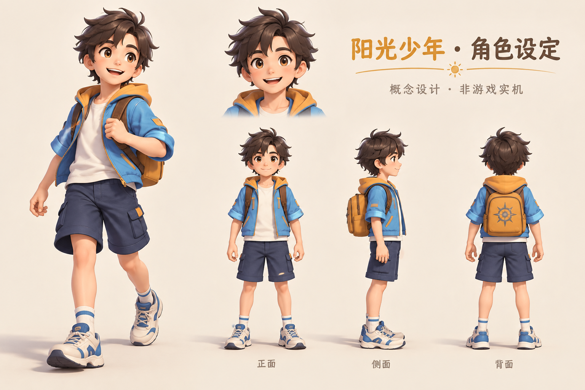

# 主人公：阳光冒险少年

## 已确认的角色设定

用户确认采用阳光、帅气、有冒险精神的小男孩形象。参考图用于明亮气质与卡通比例，制作本项目原创角色。角色概念由 imagegen 内置工具生成；概念图不是游戏运行截图，也不是可直接使用的 3D 模型。

- 约 11–13 岁、5–5.5 头身的少年比例；保留游戏原有世界尺度与碰撞参数。
- 栗色蓬松短发、温暖肤色、清亮棕眼与自然笑容。
- 蓝色短外套、暖黄色帽里、白色内搭、深蓝及膝短裤、浅色运动鞋。
- 小巧的暖黄背包与太阳徽记；背包不过腰，衣摆不过髋，背面保留摆臂与迈步轮廓。
- 不继续使用旧银发游侠的长披风、盔甲与剑鞘。

## 实现与持续迭代

`src/rendering/models/hero.ts` 是角色装配与动作入口，继续提供 `ModelRig` 接口。模型由应用持有的原创几何与材质构成，服饰、面部及头发可以独立精修；将来替换为制作完成的骨骼资产时，保持该场景接口与骑乘锚点约定。

模型面向 `-Z`，`group` 的位置与旋转由场景控制。脚步使用实际移动距离驱动；上身和髋部独立摆动，膝盖反向弯曲，鞋底落在原有接触平面。骑乘时 `riderHip` 必须是动画后、模型 group 局部坐标中的实际髋部位置，由场景对齐宠物的 `rideSeat`。不要按新头像大小重新调整整个人的坐标原点。

新增几何与材质继续由 `modelKit` 管理生命周期，动画内不创建 GPU 资源。角色与世界渲染一同延迟加载，不加入初始界面包。此概念 PNG 只保存在文档目录，不进入公开游戏资源或首次加载。

## 验收标准

- 同一光照下比较正面、侧面、背面；面部可读、头发有层次、服饰大色块清楚。
- 行走、奔跑、跳跃、骑乘及返回步行都保持稳定，鞋底接地、膝盖方向正常、背包不穿过鞍座。
- 以真实游戏镜头与手机尺寸再次检查比例、背景辨识度和界面遮挡。
- 几何数据有效，骑乘锚点与真实髋部一致，资源能够释放，保持现有加载预算。
- 图片好看不能替代实机验收；后续纹理、蒙皮与表情仍以实际可交付的模型效果衡量。

## 概念提示词摘要

原创阳光冒险男孩，约 11–13 岁，5–5.5 头身；栗色短发、友善棕眼、自然笑容；蓝色短外套、暖黄帽里、白色 T 恤、深蓝短裤、浅色户外鞋、小巧暖黄背包及原创太阳徽记。明亮卡通 3D 风格、清楚的色块和轮廓、柔和布料质感；同一角色的正面、侧面、背面及表情特写。无长披风、武器、盔甲及现有作品标志。版面明确标注“概念设计 · 非游戏实机”。
